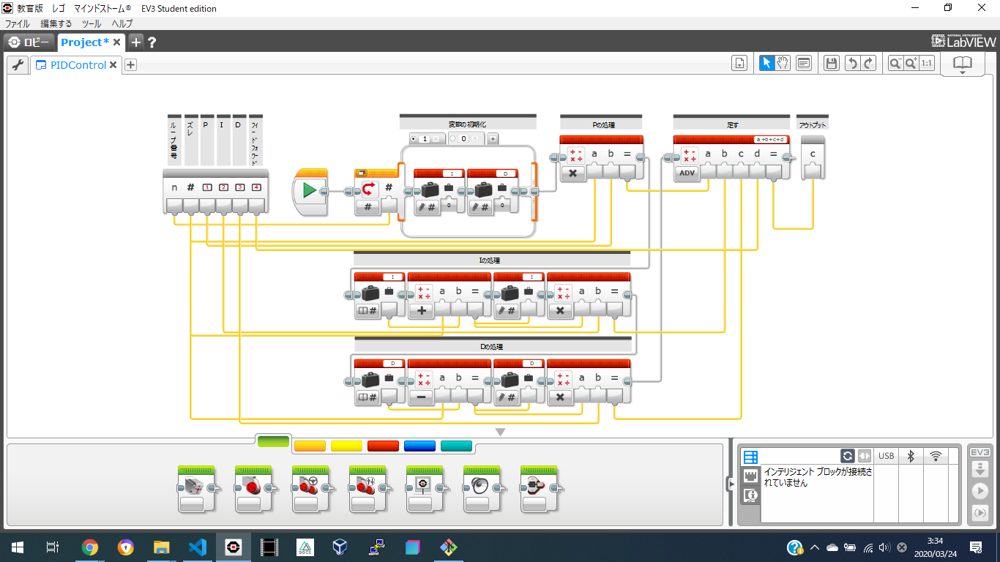

# PIDControl

PIDControlは、PID制御を使用する際に必要となるマイブロックである。

## 概要
>PID制御は、制御工学におけるフィードバック制御の一種であり、入力値の制御を出力値と目標値との偏差、その積分、および微分の3つの要素によって行う方法のことである。制御理論の一分野をなす古典制御論の枠組みで体系化されたもので長い歴史を持っている。（[Wikipedia](https://ja.wikipedia.org/wiki/PID%E5%88%B6%E5%BE%A1)）

このマイブロックは、EV3でPID制御をする際に必要な部分をまとめてマイブロックしたものである。
## パラメーター
ループ番号 | ズレ | P | I | D | FeedForward
--- | --- | --- | --- | --- | ---
変数の初期化を行うため。 | PIDの処理を行うための入力値。 | P制御（比例）のゲイン。 | I制御（積分）のゲイン。 | D制御（微分）のゲイン。 | 追加で足す値。
## ゲイン調整のコツ
Pゲインから調節し、そのあとI、Dを調節。最後にPとDを少しだけ大きくする。